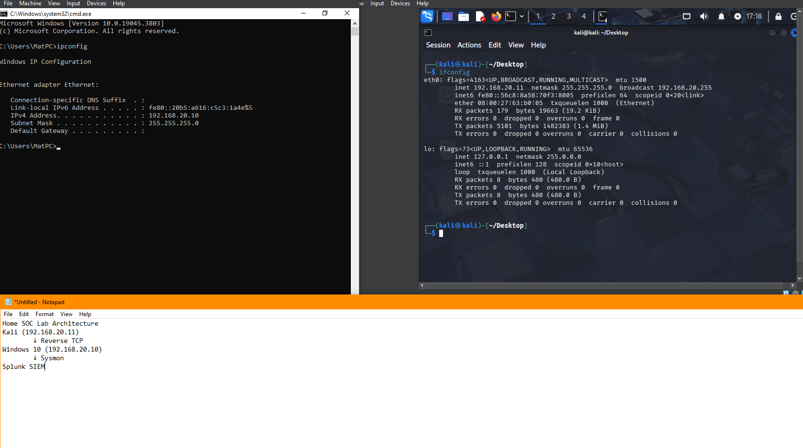
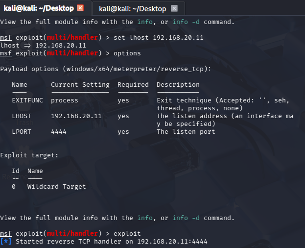
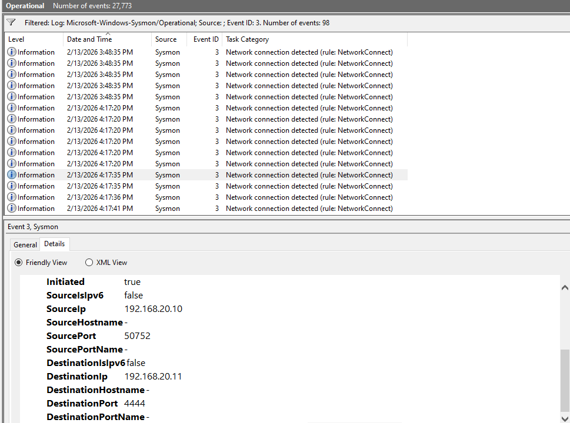
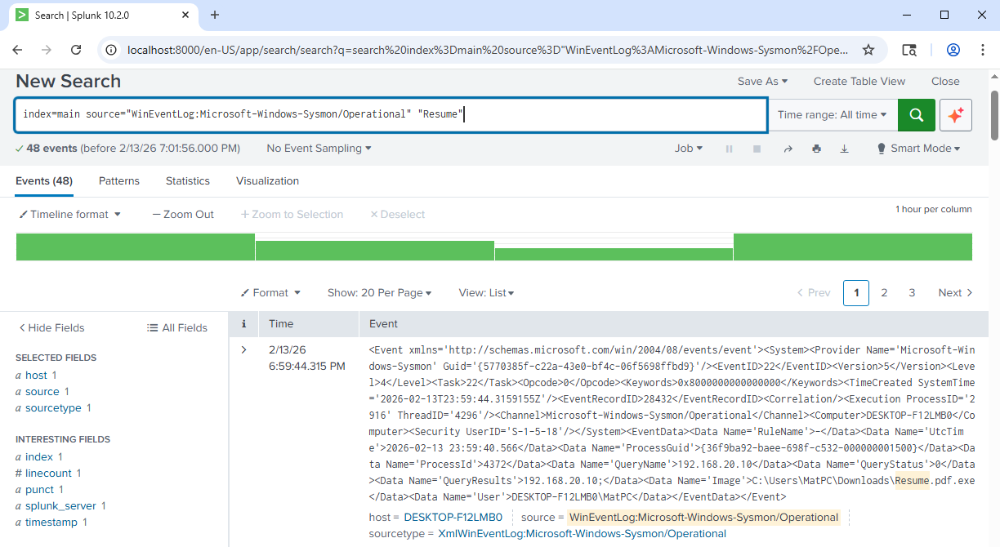

<h1>SOC Lab - Reverse TCP Detection with Sysmon & Splunk</h1>

<h2>Description</h2>
This project demonstrates a simulated reverse TCP callback attack within a controlled home lab environment and the detection of that activity using Sysmon and Splunk Enterprise.

The lab consists of two virtual machines connected via an internal VirtualBox network:

- Kali Linux (Attacker) - 192.168.20.11
- Windows 10 (Victim) - 192.168.20.10

The objective was to:
- Simulate a reverse TCP callback to port 4444
- Capture process execution telemetry using Sysmon (Event ID 1)
- Capture network connection telemetry using Sysmon (Event ID 3)
- Ingest and investigate logs inside Splunk Enterprise

This project validates end-to-end detection visibility from endpoint to SIEM.

 

<h2>Technologies and Utilities Used</h2>

- <b>Kali Linux</b>
- <b>Windows 10</b>
- <b>Metasploit Framework</b>
- <b>Sysmon (Sysinternals)</b>
- <b>Splunk Enterprise</b>
- <b>VirtualBox Internal Networking</b>

 

<h2>Lab Environment</h2>

- <b>Windows 10 VM</b> (Sysmon + Splunk Installed)
- <b>Kali Linux VM</b> (Metasploit Handler)
- <b>Internal Network (LABNET)</b>
- <b>Reverse TCP Port:</b> 4444

 

<h2>Lab Architecture</h2>

Windows 10 (192.168.20.10) → Reverse TCP → Kali (192.168.20.11:4444)
 
 

 

<h2>Attack Simulation</h2>

Metasploit reverse TCP handler configured on Kali:
 
LHOST: 192.168.20.11  
LPORT: 4444  
 
 

 

<h2>Detection - Sysmon Event ID 1 (Process Creation)</h2>

Sysmon captured execution of the suspicious file:

C:\Users\MatPC\Downloads\Resume.pdf.exe

MITRE ATT&CK mapping observed:
- T1204 – User Execution

 

<h2>Detection - Sysmon Event ID 3 (Network Connection)</h2>

Sysmon captured the outbound network connection from:

- SourceIP: 192.168.20.10  
- DestinationIP: 192.168.20.11  
- DestinationPort: 4444  

 

<h2>SIEM Investigation - Splunk</h2>

Sysmon logs were successfully ingested into Splunk.

Example search used:

index=main source="WinEventLog:Microsoft-Windows-Sysmon/Operational" "Resume"

This returned the process execution and network telemetry tied to the malicious executable.

 

<h2>Key Outcomes</h2>

- Successfully simulated a reverse TCP callback
- Validated Sysmon endpoint telemetry collection
- Confirmed Splunk ingestion of Sysmon Operational logs
- Demonstrated process + network correlation within a SIEM
- Practiced SOC-style investigation workflow

 

<h2>Author</h2>

Matthew Hizine  
M.S. Cybersecurity  
Aspiring SOC Analyst  
Atlanta, GA
